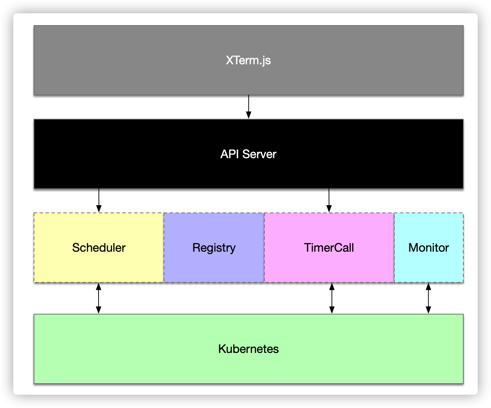

# doc
The KataSpace docs

## 系统组件

+ XTerm.js
> KataSpace前端，实现后端资源登陆、前端资源展现

+ API Server
> KataSpace统一服务入口，提供标准API服务

+ Scheduler
> 服务编排引擎，根据用户设定的资源参数进行服务编排。

+ Registry
> 镜像仓库。

+ TimerCall
> 计时引擎，实时计算每个资源的可用时间。等资源可用时间即将达到时进行资源回收

+ Monitor
> 监控引擎，支持整个KataSpace的组件监控

+ Kubernetes
> 资源计算引擎

## 组件实现

